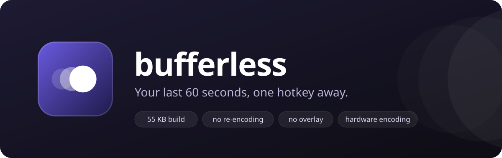
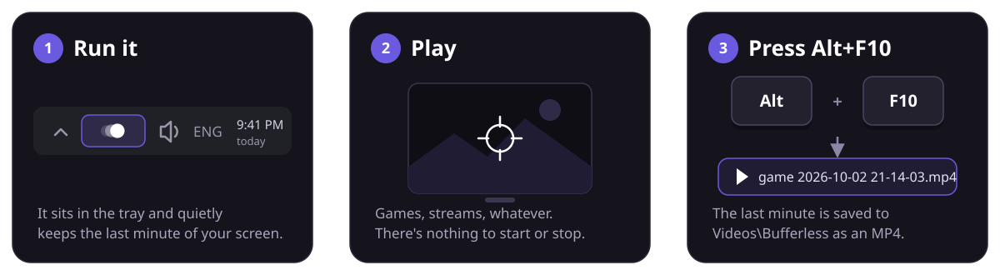
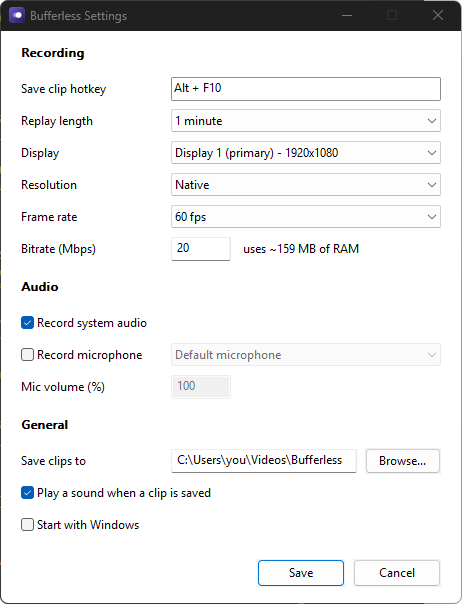
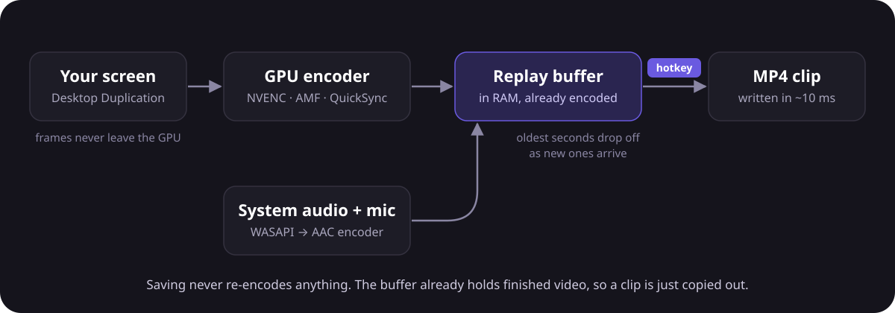

<p align="center">
  
</p>

<p align="center">
  <a href="../../releases/latest"></a>
  <a href="../../releases"></a>
  <a href="../../actions/workflows/build.yml"></a>
  
  <a href="LICENSE"></a>
</p>

**Bufferless** quietly keeps the last minute of your screen in memory. When something
worth keeping happens, press **Alt+F10** and it's saved as an MP4. It's like NVIDIA
Instant Replay without the overlay, the account, or the pile of background services.

- **Tiny.** One exe, 300 KB (or 55 KB if you want to show off). Nothing to install.
- **Light.** Your GPU's built-in video encoder does the work, so games barely notice.
- **Instant.** Saving takes about 10 ms because nothing gets re-encoded.
- **Any GPU.** Uses Windows' standard hardware encoders, so it should work on NVIDIA,
  AMD and Intel GPUs (tested on NVIDIA so far). Windows 10 and 11.

## How to use it

<p align="center">
  
</p>

1. **Download** `bufferless.exe` from the [latest release](../../releases/latest) and run it.
   There's no installer. A tray icon (three little circles) means it's recording.
2. **Play**, stream, work, whatever. It's always keeping the last minute.
3. **Press Alt+F10.** You'll hear a short chime, and the clip lands in your
   `Videos\Bufferless` folder, named after whatever was on screen:
   `cs2 2026-10-02 21-14-03.mp4`.

Click the "Clip saved" notification to jump straight to the file.

> [!TIP]
> Windows hides new tray icons behind the **^** arrow. Drag the Bufferless icon
> onto the taskbar to keep it in sight.

## Which download?

Every release has three versions of the same app. They behave identically.

| File | Size | Pick it if... |
| --- | --- | --- |
| **`bufferless.exe`** | ~300 KB | You just want it to work. **Start here.** |
| `bufferless-small.exe` | ~107 KB | You like small things. |
| `bufferless-tiny.exe` | ~55 KB | You want bragging rights. It's compressed with UPX, which antivirus tools sometimes flag as suspicious. |

> [!NOTE]
> The exe isn't code-signed, so Windows may say **"Windows protected your PC"** the
> first time. Click **More info**, then **Run anyway**.

## The tray icon

Right-click it for the menu, or double-click it to open settings.

| Menu item | What it does |
| --- | --- |
| **Save clip** | Same as pressing the hotkey. |
| **Open clips folder** | Opens `Videos\Bufferless` (or wherever you pointed it). |
| **Settings...** | Opens the settings window. |
| **Quit** | Stops recording and exits. |

If the icon looks faded, something's wrong (for example the GPU encoder couldn't
start). Hover over it to see what's going on.

## Settings



**Save clip hotkey.** Click the box and press the combination you want.

**Replay length.** How far back each clip goes, from 15 seconds to 20 minutes.

**Display.** Which monitor to record.

**Resolution.** Record smaller than your screen to save memory and disk space.

**Frame rate.** 60 fps is a good default. Going higher only helps if your monitor refreshes that fast.

**Bitrate.** Higher means sharper video but more memory. The window shows how much
RAM your choice will use.

**Record the mouse cursor.** Draw your cursor into clips. Games that hide it stay hidden.

**Audio.** Record what you hear, your microphone, or both (they're mixed into one
track). Pick which mic and set its volume.

**Save clips to.** Where clips go.

**Start with Windows.** Launch automatically when you sign in.

Settings are saved to `%APPDATA%\bufferless\config.toml`, next to a small log file.

<br clear="right">

## Questions

<details>
<summary><b>It says the hotkey is unavailable</b></summary>

Another app already uses that shortcut. It's usually the NVIDIA overlay, which owns
Alt+F10 for its own Instant Replay. Either turn off Instant Replay in the NVIDIA app,
or pick a different hotkey in Bufferless's settings (Ctrl+Alt+F10 works well).
</details>

<details>
<summary><b>How much memory does it use?</b></summary>

Around 50 MB for the app, plus the replay buffer itself. The buffer is roughly
bitrate × length: the default 20 Mbps for 60 seconds is about 150 MB. Lower the
bitrate, resolution or replay length to use less. The settings window shows the
estimate as you change things.
</details>

<details>
<summary><b>Will it slow down my games?</b></summary>

Barely. Graphics cards have a separate chip just for encoding video, and that's
what does the heavy lifting. In testing at 1080p and 60 fps, Bufferless used about
3% of one CPU core.
</details>

<details>
<summary><b>My antivirus flagged it</b></summary>

That's almost certainly `bufferless-tiny.exe`. It's compressed with UPX, a tool
malware also likes to use, so some scanners get suspicious of anything packed with
it. Use `bufferless.exe` instead.
</details>

<details>
<summary><b>Why does my clip start a little early?</b></summary>

Video is stored in chunks that start every second, and a clip has to begin at the
start of a chunk. So you might get up to one extra second at the beginning.
</details>

<details>
<summary><b>What doesn't it do (yet)?</b></summary>

- Cursors that invert the colours under them (like the text I-beam) are drawn
  in black instead.
- HDR screens are recorded in normal (SDR) colours.
- Portrait (rotated) monitors are recorded sideways.
- No trimming or editing, and no in-game overlay. That's on purpose.
</details>

## How it works

<p align="center">
  
</p>

The trick is that Bufferless keeps *finished* video in memory, not raw frames.
Your screen is grabbed with Windows' Desktop Duplication, converted and compressed
by the GPU's hardware encoder, and the result goes into a rolling buffer. Raw frames
for a minute of 1080p would take around 30 GB; compressed, it's about 150 MB.

When you press the hotkey, Bufferless copies the buffer into an MP4 file. Nothing
gets re-encoded, so it takes milliseconds, and the video looks exactly as it did
when it was recorded. Audio is captured separately and lined up with the video
using the same clock.

<details>
<summary><b>Building from source</b></summary>

You need Windows 10 or 11 and [Rust](https://rustup.rs) with the MSVC toolchain.

```
cargo build --release
```

That gives you `target\release\bufferless.exe`, the standard build.

The smaller two are built with `.\build-tiny.ps1`, which needs a nightly toolchain
and [UPX](https://upx.github.io/) (`winget install UPX.UPX`). It turns on the
`nostd` feature, which drops Rust's standard library and the C runtime: everything
the app needs from them lives in `src/rt.rs` as small Win32 wrappers. Pass `-NoUpx`
to skip the packed one.

GitHub Actions builds and tests all three on every push. Each push to `main` is
published as a release with the next patch version (v0.1.1, v0.1.2, ...); push a
tag like `v0.2.0` yourself for a bigger jump.

| File | What's in it |
| --- | --- |
| `src/capture.rs` | Screen capture, GPU colour conversion, frame timing |
| `src/encoder.rs` | Hardware H.264 encoder |
| `src/audio.rs` | System audio and mic capture, mixing, AAC encoding |
| `src/ring.rs` | The replay buffer |
| `src/mux.rs` | MP4 writer |
| `src/app.rs` | Tray icon, hotkey, saving clips |
| `src/settings.rs` | Settings window |
| `src/rt.rs` | The tiny runtime used instead of Rust's std |
| `src/icon.rs` | Draws the app and tray icons |
</details>

## License

[MIT](LICENSE). Do whatever you like with it, just keep the copyright notice.
